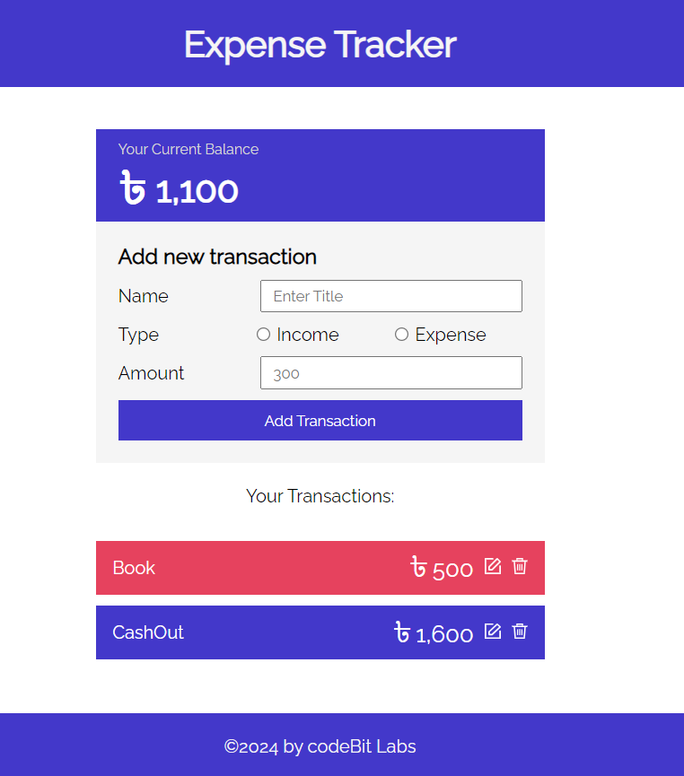

# Expense Tracker

This is a simple expense tracker that I created to help me keep track of my expenses. It is a simple web application that uses a Json Server database to store the data. The application is built using Redux and React.

## Features

- Add an expense
- Delete an expense
- View all expenses
- View total expenses
- Edit an expense

## UI of the application



## Usage

To use the application, you need to have Node.js installed on your computer. If you don't have Node.js installed, you can download it from [here](https://nodejs.org/en/).

First, you need to run the json server by running the following command in the terminal:

```bash
cd server
yarn install
yarn start
```

Then come back to the root directory and run the following command in the terminal:

```bash
yarn install
yarn dev
```

This app runs on this port: http://localhost:5173/

The application will open in your default browser. You can then start adding your expenses.
